# CMOS-Circuit-Design-Spice-Simulation-using-Sky130nm-technology
# CMOS-Circuit-Design-Spice-Simulation-using-Sky130nm-technology

# Table of Contents
* ###  [Day 1 - Basics of NMOS Drain Current ($I_d$) vs Drain-to-source Voltage ($V_{ds}$)](#day1-basics-of-nmos-drain-currentid-vs-drain-to-source-voltagevds)
  * #### [Introduction to Circuit Design and Spice Simulations](#introduction-to-circuit-design-and-spice-simulations)
-   * []  [L1 Why do we need SPICE simulations?](#l1-why-do-we-need-spice-simulations)
    * [ ] [L2 Introduction to basic element in circuit design-NMOS](#l2-introduction-to-basic-element-in-circuit-design-nmos)
    * [ ] [L3 Strong inversion and threshold voltage](#l3-strong-inversion-and-threshold-voltage)
    * [ ] [L4 Threshold voltage with positive substrate potential](#l4-threshold-voltage-with-positive-substrate-potential)
  * #### [NMOS Resistive Region and Saturation Region of Operation](#nmos-resistive-region-and-saturation-region-of-operation)
    * [ ] [L1 Resistive region of operation with small drain-source voltage](#l1-resistive-region-of-operation-with-small-drain-source-voltage)
    * [ ] [L2 Drift current theory](#l2-drift-current-theory)
    * [ ] [L3 Drain current model for Linear region of operation](#l3-drain-current-model-for-linear-region-of-operation)
    * [ ] [L4 SPICE conclusion to resistive operation](#l4-spice-conclusion-to-resistive-operation)
    * [ ] [L5 Pinch-off region condition](#l5-pinch-off-region-condition)
    * [ ] [L6 Drain current model for saturation region of operation](#l6-drain-current-model-for-saturation-region-of-operation)
  * #### [Introduction to SPICE](#introduction-to-spice)
    * [ ] [L1 Basic SPICE setup](#l1-basic-spice-setup)
    * [ ] [L2 Circuit description in SPICE syntax](#l2-circuit-description-in-spice-syntax)
    * [ ] [L3 Define Technology parameters](#l3-define-technology-parameters)
    * [ ] [L4 First SPICE simulation](#l4-first-spice-simulation)
    * [ ] [L5 SPICE lab with Sky130 models](#l5-spice-lab-with-sky130-models)

-* ###  [Day 2 - Velocity Saturation and Basics of CMOS Inverter VTC](#day2-velocity-saturation-and-basics-of-cmos-inverter-vtc)
  * #### [SPICE Simulation for Lower Nodes and Velocity Saturation Effect](#spice-simulation-for-lower-nodes-and-velocity-saturation-effect)
    * [ ] [L1 SPICE simulation for lower nodes](#l1-spice-simulation-for-lower-nodes)
    * [ ] [L2 Drain current vs gate voltage for long and short channel device](#l2-drain-current-vs-gate-voltage-for-long-and-short-channel-device)
    * [ ] [L3 Velocity saturation at lower and higher electric fields](#l3-velocity-saturation-at-lower-and-higher-electric-fields)
    * [ ] [L4 Velocity saturation drain current model](#l4-velocity-saturation-drain-current-model)
    * [ ] [L5 Labs Sky130 Id-Vgs](#l5-labs-sky130-id-vgs)
    * [ ] [L6 Labs Sky130 Vt](#l6-labs-sky130-vt)
  * #### [CMOS Voltage Transfer Characteristics (VTC)](#cmos-voltage-transfer-characteristics-vtc)
    * [ ] [L1 MOSFET as a switch](#l1-mosfet-as-a-switch)
    * [ ] [L2 Introduction to standard MOS voltage current parameters](#l2-introduction-to-standard-mos-voltage-current-parameters)
    * [ ] [L3 PMOS/NMOS drain current vs drain voltage](#l3-pmosnmos-drain-current-vs-drain-voltage)
    * [ ] [L4 Step 1 - Convert PMOS gate-source-voltage to Vin](#l4-step1--convert-pmos-gate-source-voltage-to-vin)
    * [ ] [L5 Step 2 & Step 3 - Convert PMOS and NMOS drain-source-voltage to Vout](#l5-step2--step3--convert-pmos-and-nmos-drain-source-voltage-to-vout)
    * [ ] [L6 Step 4 - Merge PMOS-NMOS load curves and plot VTC](#l6-step4--merge-pmos-nmos-load-curves-and-plot-vtc)

* ###  [Day 3 - CMOS Switching Threshold and Dynamic Simulations](#day3-cmos-switching-threshold-and-dynamic-simulations)
  * #### [Voltage Transfer Characteristics - SPICE Simulations](#voltage-transfer-characteristics-spice-simulations)
    * [ ] [L1 SPICE deck creation for CMOS inverter](#l1-spice-deck-creation-for-cmos-inverter)
    * [ ] [L2 SPICE simulation for CMOS inverter](#l2-spice-simulation-for-cmos-inverter)
    * [ ] [L3 Labs Sky130 SPICE simulation for CMOS](#l3-labs-sky130-spice-simulation-for-cmos)
  * #### [Static Behaviour Evaluation - CMOS Inverter Robustness - Switching Threshold](#static-behaviour-evaluation-cmos-inverter-robustness-switching-threshold)
    * [ ] [L1 Switching Threshold, Vm](#l1-switching-threshold-vm)
    * [ ] [L2 Analytical expression of Vm as a function of (W/L)n and (W/L)p](#l2-analytical-expression-of-vm-as-a-function-of-wln-and-wlp)
    * [ ] [L3 Analytical expression of (W/L)n and (W/L)p as a function of Vm](#l3-analytical-expression-of-wln-and-wlp-as-a-function-of-vm)
    * [ ] [L4 Static and Dynamic simulation of CMOS inverter](#l4-static-and-dynamic-simulation-of-cmos-inverter)
    * [ ] [L5 Static and Dynamic simulation of CMOS inverter with increased PMOS width](#l5-static-and-dynamic-simulation-of-cmos-inverter-with-increased-pmos-width)
    * [ ] [L6 Applications of CMOS inverter in clock network and STA](#l6-applications-of-cmos-inverter-in-clock-network-and-sta)

* ###  [Day 4 - CMOS Noise Margin Robustness Evaluation](#day4-cmos-noise-margin-robustness-evaluation)
  * #### [Static Behaviour Evaluation - CMOS Inverter Robustness - Noise Margin](#static-behaviour-evaluation-cmos-inverter-robustness-noise-margin)
    * [ ] [L1 Introduction to Noise Margin](#l1-introduction-to-noise-margin)
    * [ ] [L2 Noise Margin voltage parameters](#l2-noise-margin-voltage-paramters)
    * [ ] [L3 Noise margin equation and summary](#l3-noise-margin-equation-and-summary)
    * [ ] [L4 Noise margin variation with respect to PMOS width](#l4-noise-margin-variation-with-respect-to-pmos-width)
    * [ ] [L5 Sky130 Noise margin labs](#l5-sky130-noise-margin-labs)

* ###  [Day 5 - CMOS Power Supply and Device Variation Robustness Evaluation](#day5-cmos-power-supply-and-device-variation-robustness-evaluation)
  * #### [Static Behaviour Evaluation - CMOS Inverter Robustness - Power Supply Variation](#static-behaviour-evaluation-cmos-inverter-robustness-power-supply-variation)
    * [ ] [L1 Smart SPICE simulations for power supply variations](#l1-smart-spice-simulations-for-power-supply-variations)
    * [ ] [L2 Advantages and disadvantages using low supply voltage](#l2-advantages-and-disadvantages-using-low-supply-voltage)
    * [ ] [L3 Sky130 Supply variation Labs](#l3-sky130-supply-variation-labs)
  * #### [Static Behaviour Evaluation - CMOS Inverter Robustness - Device Variation](#static-behaviour-evaluation-cmos-inverter-robustness-device-variation)
    * [ ] [L1 Sources of variation - Etching process](#l1-sources-of-variation---etching-process)
    * [ ] [L2 Sources of variation - Oxide thickness](#l2-sources-of-variation---oxide-thickness)
    * [ ] [L3 Smart SPICE simulation for device variations](#l3-smart-spice-simulation-for-device-variations)
    * [ ] [L4 Conclusion](#l4-conclusion)
    * [ ] [L5 Sky130 device variations labs](#l5-sky130-device-variations-labs)

# **Day 1 - Basics of NMOS Drain current (Id) vs Drain-to-source Voltage (Vds)**

## Introduction to Circuit Design and SPICE simulations

### L1 Why do we need SPICE simulations?

 A CMOS circuit design has both PMOS and NMOS transistors are connected together in a specific different fashion to form logic gates such as NAND, NOR, AND, OR, etc. These basic gates are the building blocks of all digital circuits.A standard CMOS inverter is built using a PMOS connected to $V_{DD}$ and an NMOS connected to $V_{SS}$ driving a load capacitance ($C_L$).
 
.jpg)

The above inverter circuit has certain electrical characteristics.To understand its behaviour ,we perform SPICE simulations which help us analyze important parameters such as delay,switching behavior,and performance.Based on these results,we can determine the proper  W/L (width /Length) ratio of the transistors .

### VTC Circuit and Waveform Plot
.jpg)

* **Voltage Transfer Characteristics (VTC):** By plotting $V_{out}$ against $V_{in}$, we observe how the circuit switches b/w pmos and nmos. 
* **Operating Regions:**
  - When $V_{in} = 0V$, PMOS is in **Linear** and NMOS is **Off** ($V_{out} = V_{DD}=2$).
  - As $V_{in}$ reaches the center threshold ($V_{in} = 1V$), both transistors enter the **Saturation** region simultaneously.
  - When $V_{in} = 2V$, PMOS is **Off** and NMOS operates in the **Linear** region ($V_{out} = 0V$).

### Why do we need SPICE?

 Clock Tree Synthesis (CTS), crosstalk, and timing analysis are completely dependent on 
SPICE (Simulation Program with Integrated Circuit Emphasis).Without SPICE, it would not be possible to calculate delays, and without delay information, 
physical design and timing verification would not be meaningful.

.jpg)

 Suppose we perform CTS on a circuit using buffers that are connected with different capacitive loads at their outputs.
By performing SPICE simulation ,we get a **Delay Table** for these buffer cells.

* **Buffer Trees:** Buffering is used across multiple levels (Level 1, Level 2) to maintain a clean clock signal and balance capacitive loads.
* **Delay Tables (Look-up Tables):** In Static Timing Analysis (STA), circuit delays are calculated dynamically based on two key parameters:
  1. **Input Slew:** The transition speed of the incoming signal.
  2. **Output Load:** The total capacitance ($fF$) the node needs to drive.

By mapping the input slew (e.g., $40ps$, $60ps$) against output load (e.g., $30fF$, $50fF$) in the lookup matrices, we can determine the precise delay value at their intersection point.
This delay tables for the level 1 and level 2 buffers is a direct result of transistor-level circuit design and SPICE simulation.

 .jpg)
.jpg)
 
Therefore, SPICE plays a fundamental role in CMOS circuit design, as it allows us to characterize and
evaluate circuit performance accurately before implementation.

 ### L2 Introduction to basic element in circuit design-NMOS
An NMOS is a **4-terminal device** composed of a Gate (G), Source (S), Drain (D), and Body/Substrate (B) built over a P-substrate with $n^+$ diffusion regions(source and drain).

Above the substrate, there is a thin oxide layer, and on top of it a metal layer is deposited, which acts as the Gate terminal.
.jpg)

#### Threshold Voltage:
Threshold voltage ($Vt$) is a very important parameter in MOSFET operation, all the characteristics of a device depends on this value.

Initially,

**At $V_{gs} = 0V$:**
*  Means source,drain and body terminals are grounded.
*  P-substrate and n+ doped regions act as reverse-biased PN junction diode and as there is no potential so there is a high resistance. **No channel formation** is there.The device remains **Off**

.jpg)
  
**Applying $+ve$ $V_{gs}>0$:**
* Now positive charge on the gate repels holes or positive charge in substrate and starts attracting negative charges (electrons) below the gate oxide layer in the substrate.
* This is beginning of the channel formation

.jpg)
.jpg)

### L3 Strong inversion and threshold voltage
Due to the accumulation of negative charges,there will be formation of Depletion Region, depleting of substrates majority carriers i.e positive carriers here .
  The further increase in the gate voltage $V_{gs}$ results
  * More positive carriers are repelled
  * Increase of depletion region width

.jpg)
 
  * **Inversion Layer:** At some point, the semiconductor surface completely converts into an **n-type material** from p-type,this process is called **Strong or Surface inversion**.
  * The gate voltage at which the strong inversion happens is called the **Threshold Voltage**

.jpg)

What will happen if we further increase Vgs>Vt?
* As there are no more negative charges in the substrate that will be attracted towards the positive Vgs, The negative charges from n+ region will get attracted opening a conducting channel for current to flow from drain to source.
* However,since there is no drain voltage,the current cannot flow from source to drain.

.jpg)

Now let us observe what happens when we change the **body (substrate) potential**.

The depletion region beteween the source and body increases due to the reverse bias at source terminal

.jpg)

### L4 Threshold voltage with positive substrate potential
If we increase the Vgs,depletion region wil increase in both the cases. But in the second case as the +ve Vsb pulls few charges from channel will be pulled towards the source.
* Results in slower inversion
* Increases the value of threshold potential due to +ve Vsb

.jpg)

.jpg)

.jpg)

The relation between threshold voltage and substrate bias is given by parameters such as Gamma (γ), which are obtained from the fabrication process.

.jpg)

* **Conclusion(Body Effect):** When an additional reverse bias voltage ($V_{sb}$) is applied between the source and the body substrate, the depletion layer width broadens near the source, which directly increases the device's threshold voltage ($V_{th}$).

##  NMOS resistive region and saturation region of operation

## L1 Resistive region of operation with small drain-source voltage
In previous lectures, we have studied about the cut-off region. Now, we will study **the Resistive or Linear** region by applying a small drain-to-source voltage (Vds).

As the gate voltage (Vgs) increases:

* The width of channel increases
* More charge carriers are available for Conduction Channel Formation

.jpg)

.jpg)

 The induced charge in the channel is proportional to:

**(Vgs - Vt)**

Now, let us Assume:

Vds = 0.05V

Vt = 0.45V

Vgs is slightly greater than Vt and small initially 

.jpg)

Since the source is grounded and drain is at some potential there will be formation of voltage gradient along the channel

The Effective Channel Width is slightly smaller than the actual channel width due to some fabrication factors

.jpg)

 Here
 * y axis → the width of transistor
 * x axis →  voltage across the channel.
On applying Vds, every point on x axis will vary w.r.t to Vgs-V(x), this will decide the current equation.

### L2 Drift current theory
We know that the effective channel voltage (Veff) will vary w.r.t x, 
sky-2(386973605301613).jpg)
Example:
* At x = 0 → Vgs - V(x) = 1V
* At x = Vds → Vgs - V(x) = 0.95V

.jpg)

The induced charge equation is proportional to the effective channel voltage and depends on the position x

**The types of current:**

* Drift current
* Diffusion current
Because of the potential difference across the channel there exists a drift current

Here, drift current dominates because of the electric field.

.jpg)

To calculate drain current, we consider the top view of the transistor.

.jpg)

 ### L3 Drain current model for linear region of operation
Since there is a voltage variation along the channel which results in variation in carrier velocity.

Velocity depends on the following factors:
* Mobility (μ)
* Electric field (E)

.jpg)

By integrating the above equation where,
* limits of dV will be from 0 to Vds.
* limits of dx will be from 0 to L.

.jpg)

.jpg)

Technology parameters:

* Oxide Capacitance (Cox)
* Width and Length (W/L) ratio
* Mobility (μn)
* Threshold voltage (Vt)
These parametes are helpful in SPICE simulations to find out the characteristics.

 .jpg)

 But, here we cannot say that it is in Linear region, since the Drain current is the quadratic function of Vds. We will calculate the Id with the given values.

 Now we can say that Even though equation is quadratic in Vds, the device behaves as **linear** when:

**(Vgs - Vt) ≥ Vds**

### L4 SPICE conclusion to resistive operation
To analyze the impact of Vgs and Vds on the drain current,we will consider different values of Vgs and Vds as shown
* Sweep Vgs
* Sweep Vds
Condition for linear region:

(Vgs - Vt) > Vds

.jpg)

.jpg)

But calculating Id for different values of Vgs and sweeping Vds until (Vgs-Vt) at every value is complex
So,to calculate Id for different values:

We will use **SPICE simulation** here.

### L5 Pinch-off region condition
When Vds exceeds the value (Vgs-Vt) the region of operation is called "Saturation Region". We know the channel voltage is Vgs-Vds. Now, we will increase the Vds.

* When Vgs-Vds > Vt, there will be a conducting channel.

.jpg)
  
* When Vgs-Vds = Vt, At drain side,  Inversion has just happened as it is equal to Vt, so channel will start disappearing at drain side.This is the beginnig of the **Pinch-off**

.jpg)

.jpg)

.jpg)

* When Vgs-Vds < Vt, the channel has disappeared at drain side.

.jpg)

This region is called as "Saturation region".

### L6 Drain current model for saturation region of operation
At saturation region, the channel voltage is constant i.e 'Vgs-Vt', and the drain current will not depend on Vds.
To get drain current equation in saturation region we will replace Vds as Vgs-Vt.

According to the equation, the mosfet acts as perfect current source. But this is not true.
* we can see that increasing Vds also increases the depletion region at the Drain which reduces the effective channel length
* This causes slight increase in current (Resembles slight dependence of Vgs over Id )

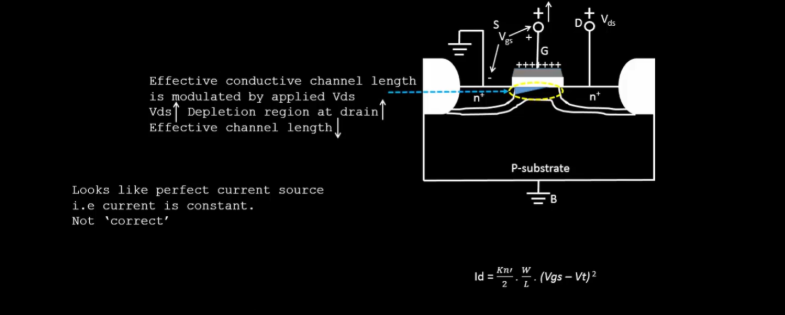

This effect is called as **Channel Length Modulation**

## Introduction to SPICE

### L1 Basic SPICE Setup

First, let us understand the SPICE simulation setup.

**SPICE Setup**

.jpg)

Some parameters are fixed and provided by the foundry. These are pre-defined and do not need to be calculated manually.

.jpg)

.jpg)

By providing:

* SPICE model parameters
* SPICE netlist

When we feed the SPICE model parameters and SPICE netlist into the SPICE software,
We can obtain device characteristics such as Id vs Vds for different Vgs values.

**SPICE Netlist** is used to feed the MOSFET device into SPICE engine in specific manner by defining its equivalent circuit in SPICE for simulation.

.jpg)

### L2 Circuit Description in SPICE Syntax
To write a SPICE netlist, follow these steps:

* Define nodes
* Assign names to nodes
* Write component connections

.jpg)

A MOSFET has 4 terminals:

* Drain
* Gate
* Source
* Substrate
It is written in the order: D G S B (DGSS format)
The SPICE Syntax of a MOSFET underly b/w 4 terminals
.jpg)
.jpg)
.jpg)
.jpg)
.jpg)
.jpg)
.jpg)
.jpg)

This represents a long-channel MOSFET.

Similarly, SPICE syntax for a resistor underly b/w 2 terminals is:

.jpg)
.jpg)
.jpg)
.jpg)

Similarly, SPICE syntax for a voltage source underly b/w 2 terminal is:

.jpg)
.jpg)
.jpg)
.jpg)
.jpg)
.jpg)
.jpg)

### L3 Define Technology Parameters
Each MOSFET requires a model file containing technology parameters.Now we will look for model of this particular NMOS.By using the technology parameters in model file it is easy to model the NMOS. The models for the name NMOS will be found in file which has the attribute of the similar name.

.jpg)

These parameters are defined inside model libraries.

.jpg)

We include this packaged file in .mod file and call this file in the SPICE netlist.

.jpg)

.jpg)

In SPICE, Lines starting with ** * ** represents the comments.

.jpg)

.jpg)

To analyze MOSFET behavior, we sweep Vgs and Vds.

.jpg)

.jpg)

**Output:**
* Id vs Vds curves for different Vg

### L5 SPICE lab with Sky130 models

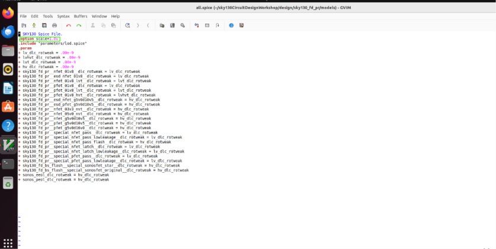

In all.spice file,we can see that W and L values are in microns

# Day2-Velocity saturation and basics of CMOS inverter VTC

## SPICE simulation for lower nodes and velocity saturation effect

### L1 SPICE simulation for lower nodes

We have observed the curve for Id vs Vds for different values of Vgs.

In the above graph:

* Left side of curve (Vds = Vgs − Vt) → Linear region
* Right side → Saturation region
* Bottom → Cut-off region (Device OFF)
  
This behavior is for long channel devices.

At certain transition point of Vds the region is not completely saturated nor completely linear

This is how the Id equation maps the graphical curves

Now, we take different values of W and L while keeping W/L constant. Ideally, we expect Id should remain the same, but practically, it does not obeys.

Below is the SPICE deck where only W and L are changed and everything remians same

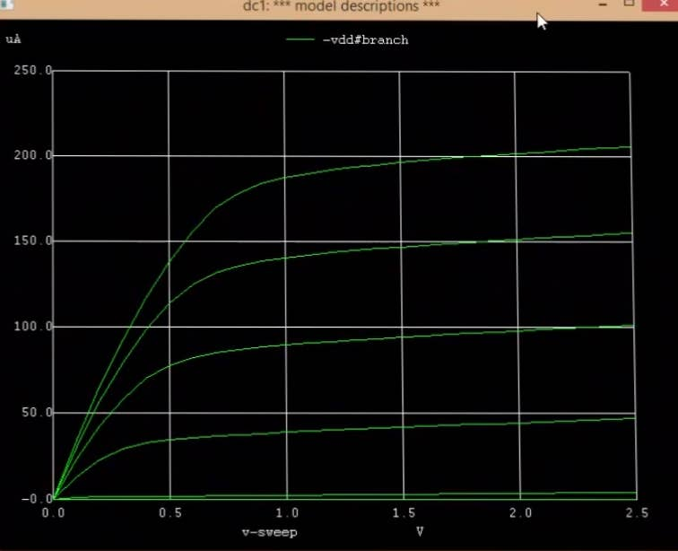

### L2 Drain current vs gate voltage for long and short channel device

Plot Id at different values of Vgs and Vds

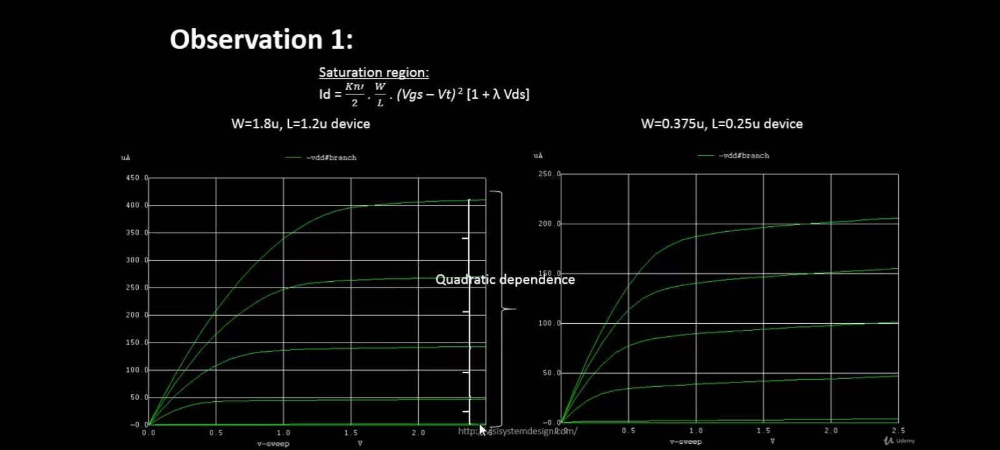

Let us compare the two simulations.

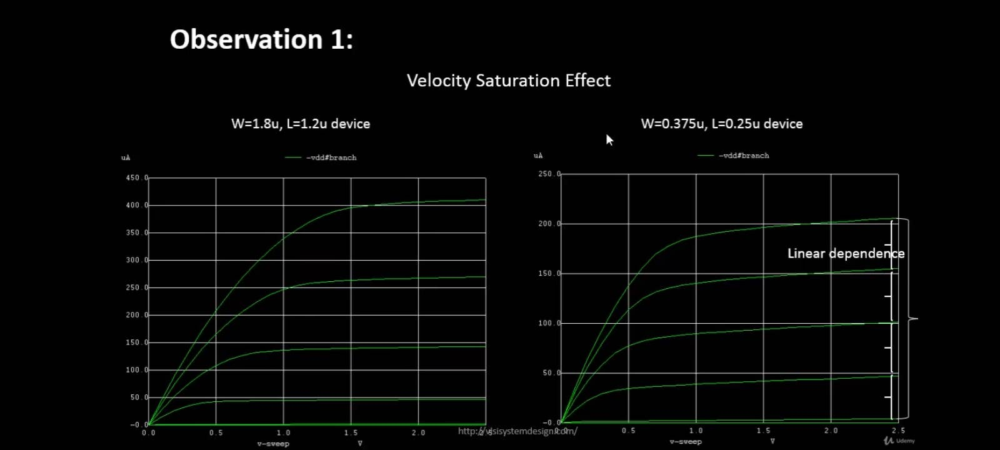

**Observations :**

* For long channel devices :

   At Vds = 2.5V , Id has quadratic dependency on Vgs 

* For short channel devices :
 
   For lower values of Vds,Id shows quadratic behaviour w.r.t Vgs .After certain point Vds=2.5V
  
   Id has shown linear behavior due to velocity saturation.

For Long Channel Device (L = 1.2µm): 

Now we plot Id vs Vgs graph seeping Vds to 2.5V with a step size of 2.5 i.e Vds=2.5 

This syntax means the left-side parameter is swept/tuned for every value of the right-side parameter.

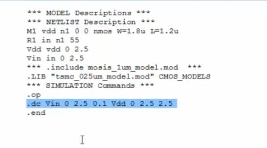

For short channel device (L = 0.25µm):

Any Device L<=0.25 is a short channel device

### L3 Velocity saturation at lower and higher electric fields

For Short Channel Devices,we will see more of a linear behaviour as the Vgs increases (Id vs Vgs). This is due to velocity saturation effect.

* Higher values of Vgs - Linear Function of Id
* Lower values of Vgs - Quadratic Function of Id

Velocity Saturation is one of the Short Channel Effect which becomes one of region for operating the lower nodes 

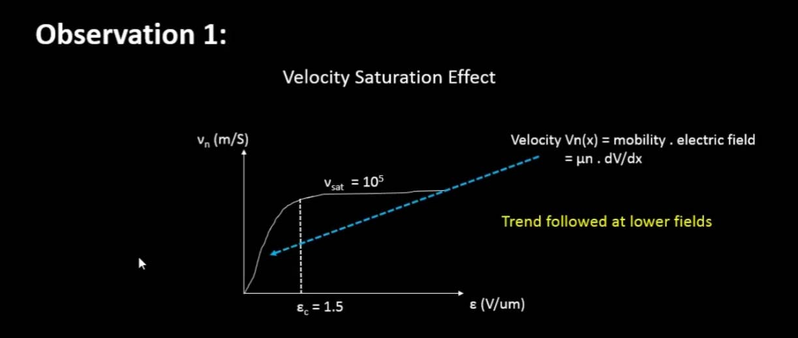

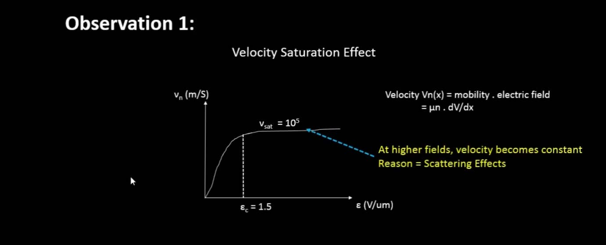

For lower nodes,

We have have 4 regions of operations: 
* Cut Off
* Linear
* Saturation
* Velocity Saturation
  
**Velocity Saturation :**

 We know that velocity and electric field are related to each other 
 * v=uE
where,
* v is velocity
* E is electric field
* u is mobility.

Velocity increases linearly with electric field over certain electric field value(upper limit) after which it gets saturated. This is due to scattering at higher fields and mobility decreases.
* Low values of Electricfield : Velocity is linear
* High values of Electricfield : Velocity is saturated

From the Device physicis point of view

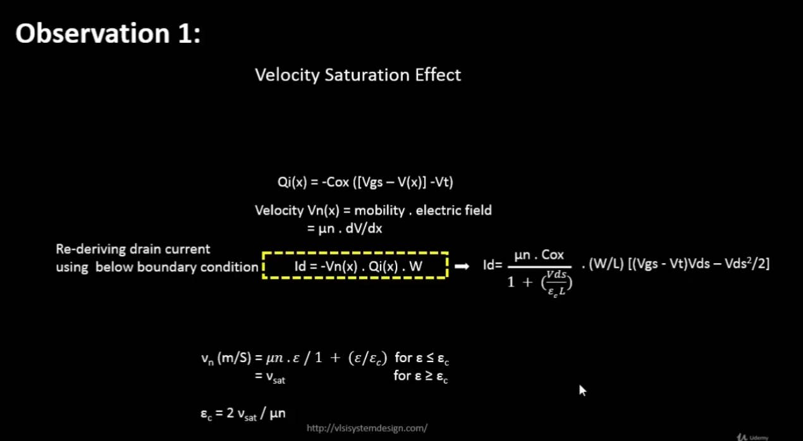

We will now Re-derive Id

The velocity saturation happens at higher values of Vgs

### L4 Velocity saturation drain current model
Here we are considering large values of Vgs

* Let Vgs − Vt = Vgt

For small values of Vds, we neglect (1+λVds) term

* Another technology parameter is **Vdsat** it defines at what value of voltage the device enter into velocity saturation
  simply ,where velocity saturation begins.

#### Cut-off Region Equation
* Device is OFF i.e Id=0

#### Saturation Region Equation
* When Vgs-Vt i.e Vgt is minimum implies Vds is maximum

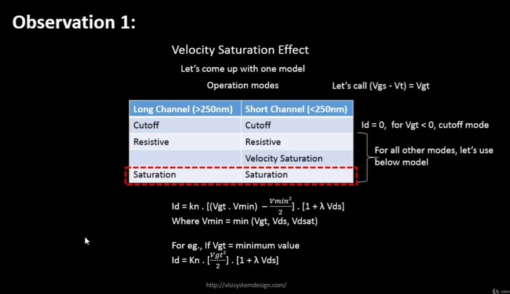

#### Resistive Region Equation
* When Vds is minimum i.e the lower values derive drain current Id 

#### Velocity Saturation Region Equation

* When Vd sat is minimum

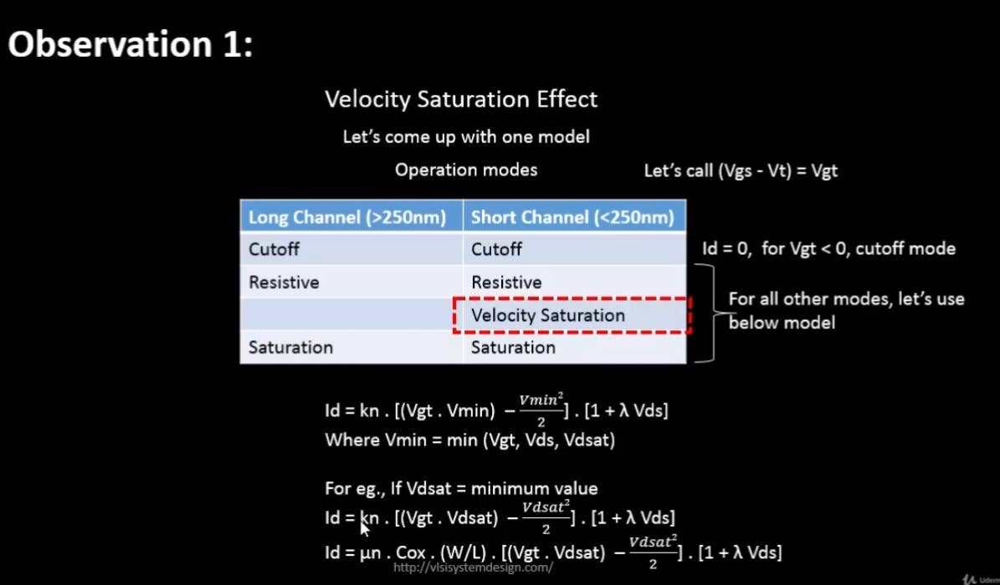

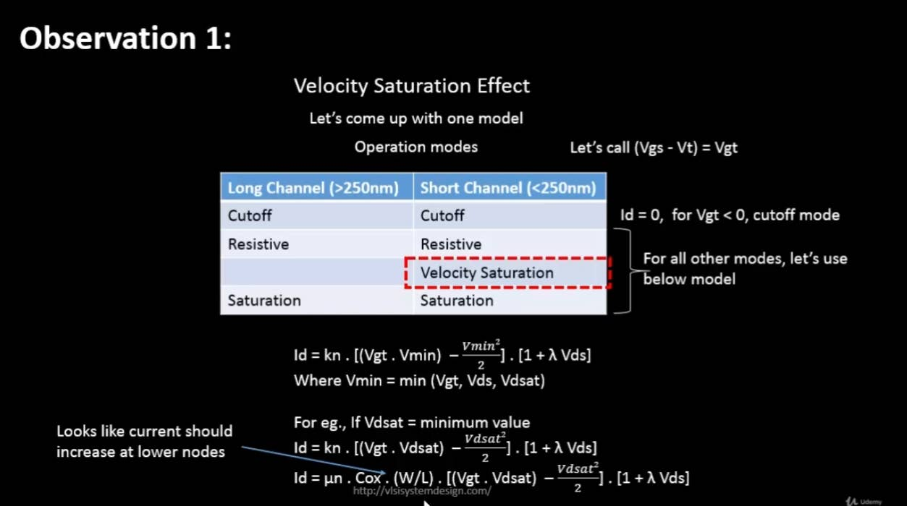

In the above equation, it seems when W is constant and L is lowered then Id should increase, But it is not so practically.

**Observation :**

The saturation current for lower nodes is low instead of being high. This is because Velocity saturation tends to saturate the device early.

Hence,Velocity saturation limits peak current So, peak current of lower nodes is smaller than the higher nodes

### L5 Labs Sky130 Id-Vgs

 Let us do SPICE Simulation for lower nodes

**Id-Vds**

Let us simulate drain characteristics
 
 Now go to the Day 2 Vds file.

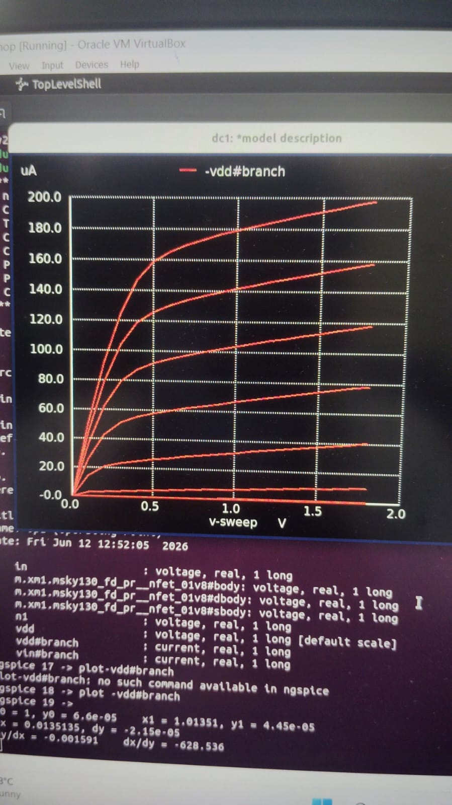
 The above graph is Id vs Vds for different values of Vgs. 

* For low values of Vgs → Quadratic behaviour
* For high values of Vgs → Linear behavior

## CMOS voltage transfer characteristics (VTC)

### L1 MOSFET as a switch

From the device point of view let us see how simple _MOSFET_ acts as _Switch_

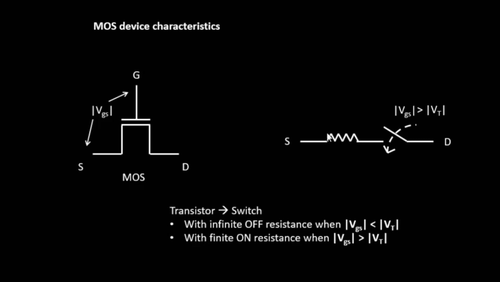

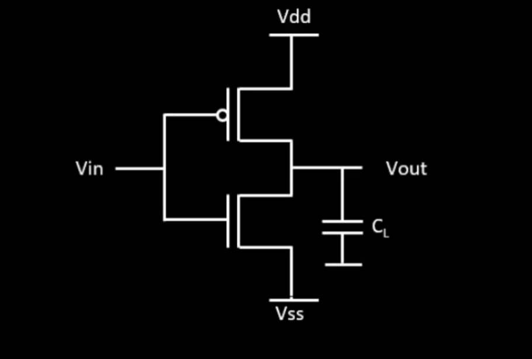

* PMOS -  on the top of CMOS   - source connected to VDD
* NMOS - on the bottom of CMOS - source connected to VSS(ground)

The Load Capacitor C_L at the drain can be connected as input to the next inverter it can de a wire,inverter or a logic gate

Biasing of CMOS inverter

* When |Vgs| < Vt → Device OFF (open switch)
* When |Vgs| > Vt → Device ON (closed switch)

Conditions for PMOS

* _Vgs_p <-Vt : Turn ON_
* _Vgs_p >-Vt : Turn OFF_

Conditions for NMOS

* _Vgs_n > +Vt : Turn ON_
* _Vgs_n < +Vt : Turn OFF_

### L2 Introduction to standard MOS voltage current parameters

By varying the Boundary Conditions

- At Vin = Vdd (high)
- At Vin = 0 (low).
  
By using the  the  above conditions we will calculate  individual equivalent circuits and merge them to we can get Voltage Transfer Characteristics(VTC)

Let Vdd= 5V 
* When **Vin = Vdd**,then
  - Vgs_n = 5 - 0 = 5V - NMOS ON  - acts as a closed switch
  - Vgs_p = 5 - 5 = 0V - PMOS OFF - acts as a open switch

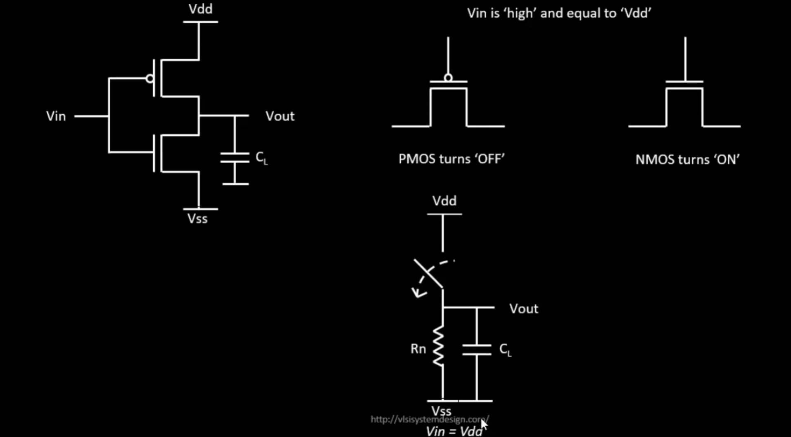

* When **Vin = 0**,then
  - Vgs_n = 0 - 0 = 0V - NMOS ON  - acts as a closed switch
  - Vgs_p = 0 - 5 = -5V - PMOS OFF - acts as a open switch

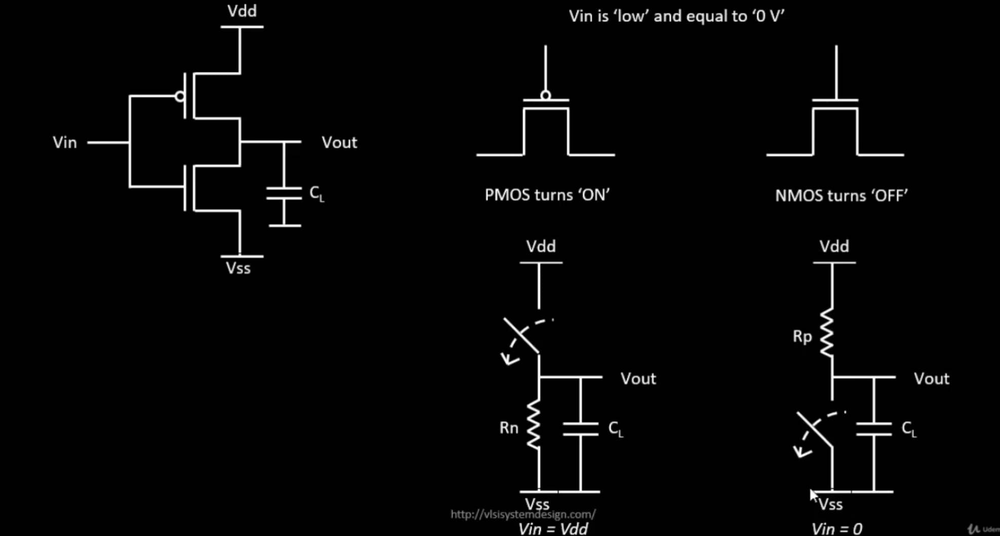

**Output Capacitor Behaviour**

We can observe that when Vin=Vdd There is a direct path that exists between Vss and Vout, the capacitor C_L discharges through the resistor.
Similarly when Vin=0 there is a direct path exists between Vdd and Vout, C_L charges.

But the direction os current is not same

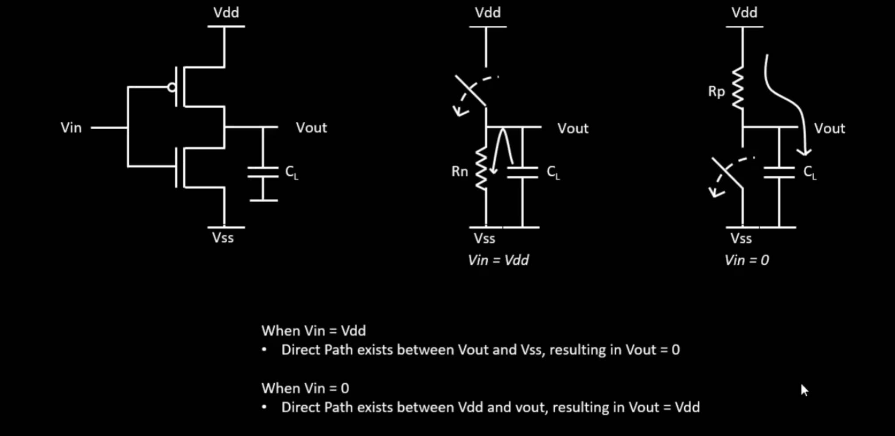

**Naming Convention**

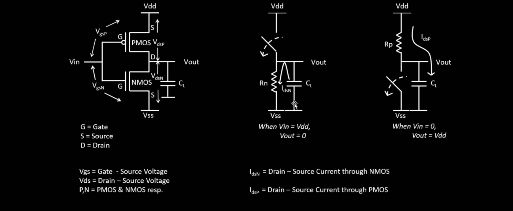

**Observation**

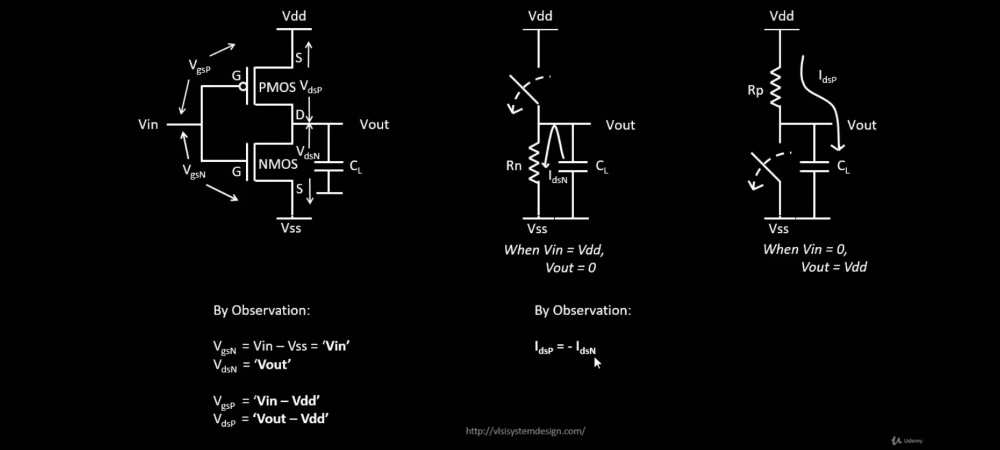

### L3 PMOS/NMOS drain current vs drain voltage

As the direction of current is reverse _Ids_p = -Ids_n_

We applied the reverse potential to the PMOS 

Now, we get the curve between Ids_n Vs Vds_n and Ids_p Vs Vds_p, it is as shown below.

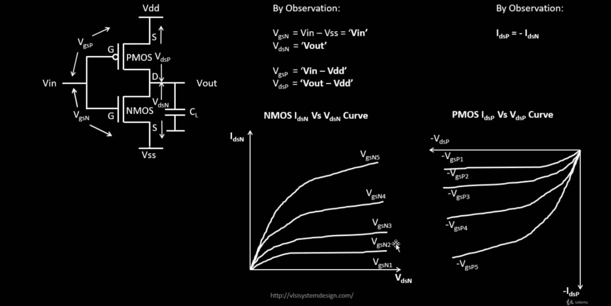

Below are the steps to obtain VTC for static CMOS inverter

### L4 Step1- Convert PMOS gate-source-voltage to Vin

We have lot of terms of internal voltages like Vgs,Vds,Vgd..tec, but when we see in logic block point of view(user's perspective) .We can have only two voltages _Vin_ and _Vout_. The Internal node voltages are not visible because they can not be used in digital design.

So we need to convert every node voltage into the function of this two voltages _Vin_ and _Vout_

To get rid of this node voltages, we modify the load curves of NMOS and PMOS to calculate the VTC and eventually we get to know the delay.

Let us assume that it is a long channel device with Vdd=2V

#### Step 1

The graph of PMOS in terms of Idsn and also the corresponding Vin value of Vgs_p is being plotted as shown in the below graph.

_Ids_n = -Ids_p_

We know that Vgs_p = Vin − Vdd

             Vin = Vgs_p + Vdd

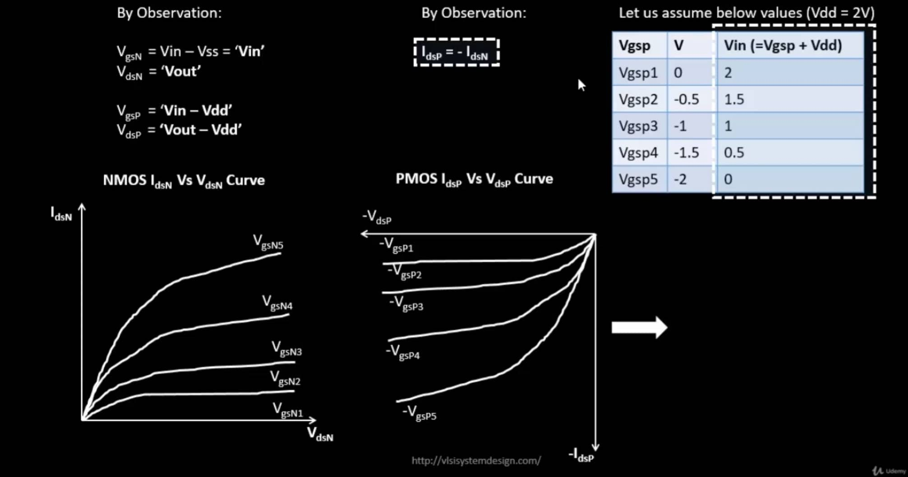

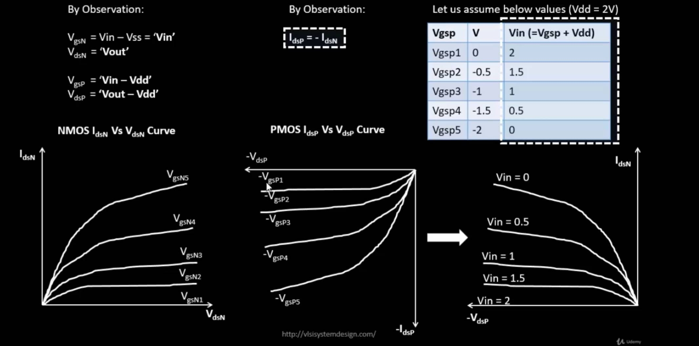

### L5 Step2 & Step3- Convert PMOS and NMOS drain-source-voltage to Vout

#### Step 2
Now Let us convert Vds_p into the function of output voltage Vout. 

We know Vds_p = Vout - Vdd

        Vout = Vds_p + Vdd
        
 So to get Vout, there is a shift of Vdd towards left hand side.

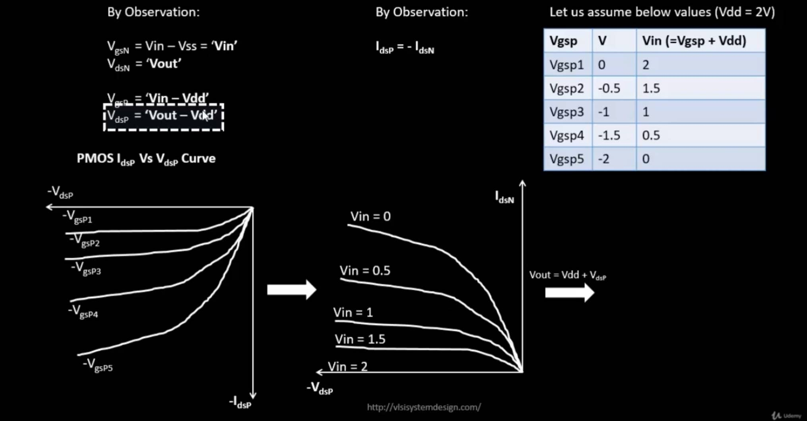

**Observations :** 

* When Vout = 2V ,we have Vds_p = 0V and Vdd = 2V (given), then the current is zero and capacitor at the output gets discharged. This is true only when PMOS is in combination with NMOS and forms a CMOS inverter.
* When Vout = 0V, we have Vdsp = -2V and Vdd = 2V, so at every gate voltage of Vin we will see a finite current whenever Vout = 0V. As Vout=0V, the capacitor is completely discharged and we need to charge that, so that is the charging current required.

Therefore ,the load curve for PMOS is

#### Step 3
Now Let us try to get the "load curve" for NMOS transistor in terms of Vin and Vout

We know that,

NMOS relation is simple: Vgsn = Vin

                         Vdsn = Vout

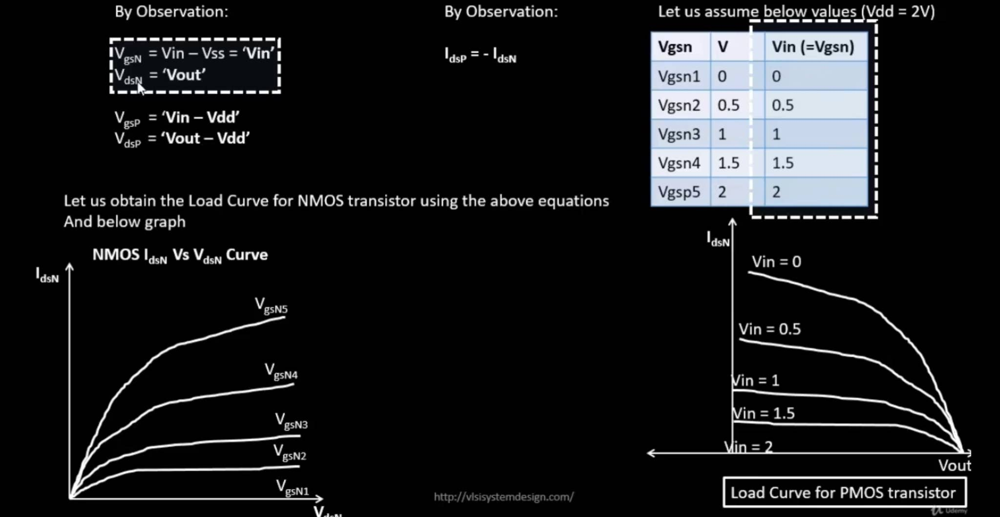

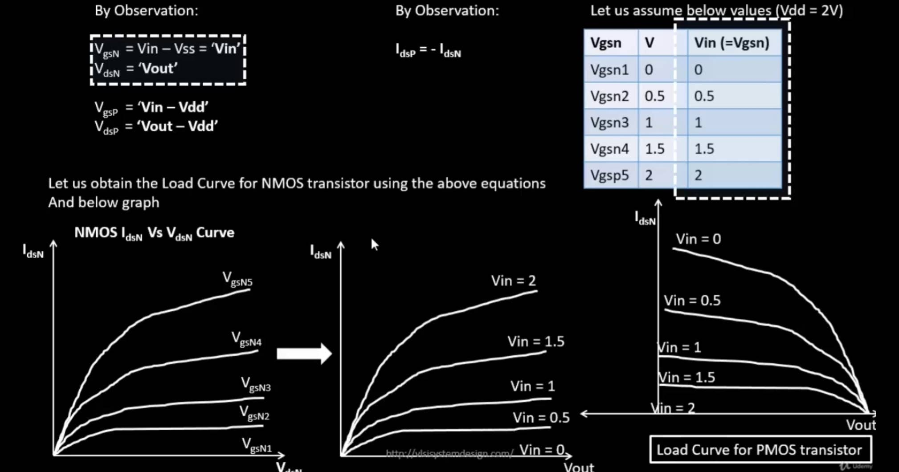

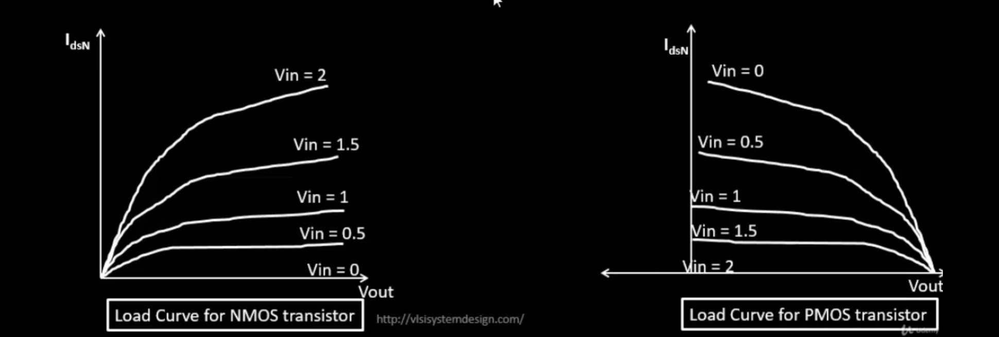

### L6 Step4- Merge PMOS-NMOS load curves and plot VTC

We are now able to obtain the Voltage Transfer Characteristics (VTC) by merging the load curves of NMOS and PMOS for CMOS inverter.

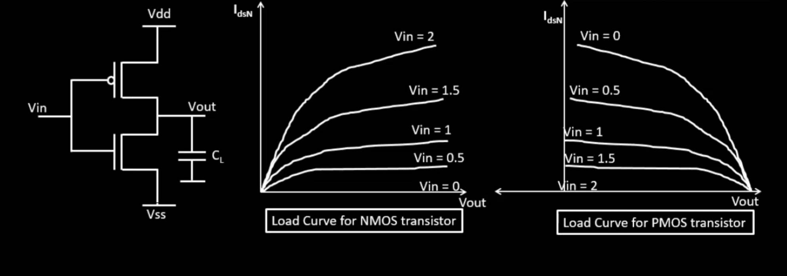

For this ,we will superimpose both of the Load Curves and by joining the intersection points between NMOS and PMOS load curves gives VTC.

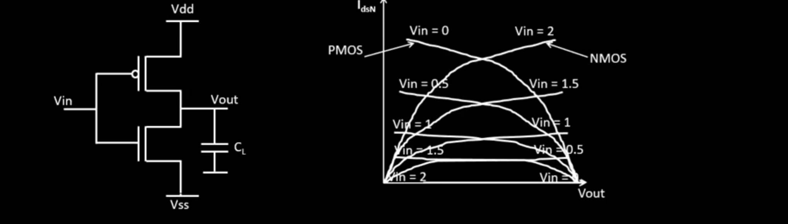

**Operating regions :**

The range of Vin and Vout is 0V-2V.

* At Vin = 0V, Vout = 2V → NMOS is Cut Off region,PMOS is in Linear region
* At Vin = 0.5V, 1.5V < Vout < 2V → NMOS is in Saturation region,PMOS is in Linear region.
* At Vin = 1V, 0.5V < Vout < 1.5V → NMOS and PMOS are in Saturation region.
* At Vin = 1.5V, 0 < Vout <0.5V → NMOS is Linear region,PMOS is in Saturation region.
* At Vin = 2V, Vout = 0V → NMOS is in linear region,PMOS is Cut Off

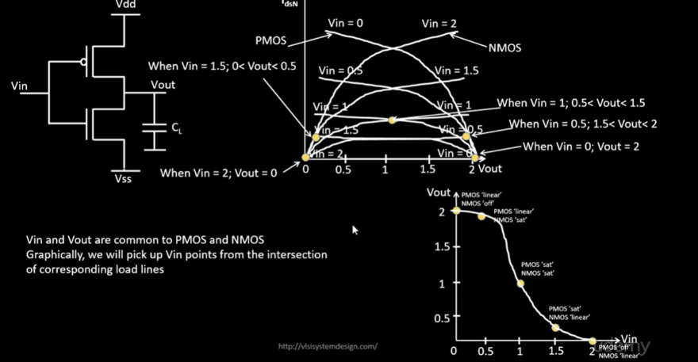

The slope gives high gain at the sharp transition region because any small change in Vin causes huge change in Vout

# Day3-CMOS switching threshold and dynamic simulations

## Voltage transfer characteristics-SPICE simulations

### L1 SPICE deck creation for CMOS inverter

Now let's simulate the VTC of CMOS inverter using a SPICE deck. It is a connectivity information (Netlist) which contains information about components of CMOS inverter, which defines:

* Component Connectivity
  
Here,

- M1 is PMOS
- M2 is NMOS

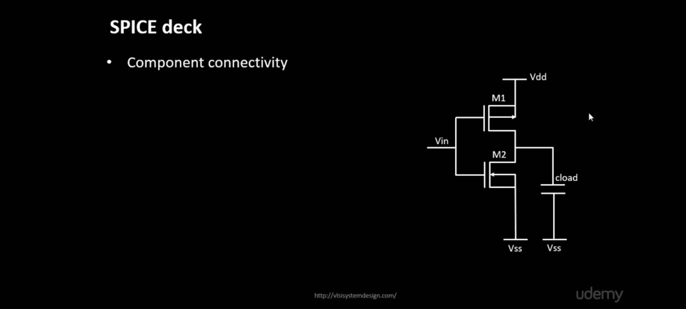
  
* Component values
  
Next, we define W/L ratios and voltage values. Equal sizing means balanced PMOS and NMOS strength.

* Identify Nodes
  
Then we identify nodes which are points where two components connect  to each other. SPICE runs simulations based on these nodes.

* Name Nodes
  
 Naming nodes ensures proper simulation which we can see them in model file 

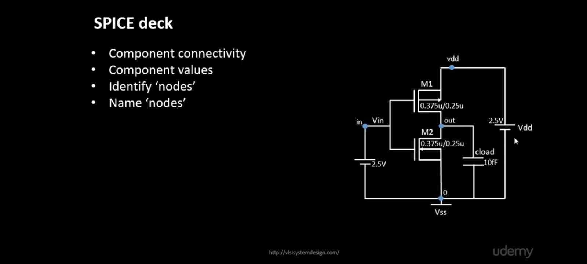

Now let's write Spice deck

SPICE syntax for MOSFET:

* Drain Gate Source Body(substrate) (**DGSS**)

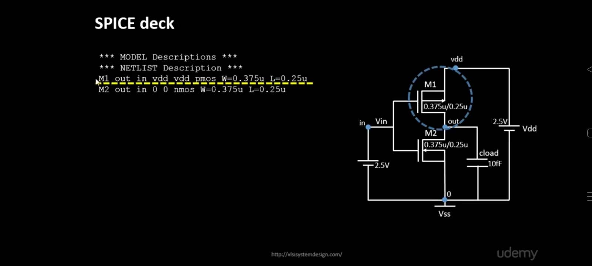

### L2 SPICE simulation for CMOS inverter

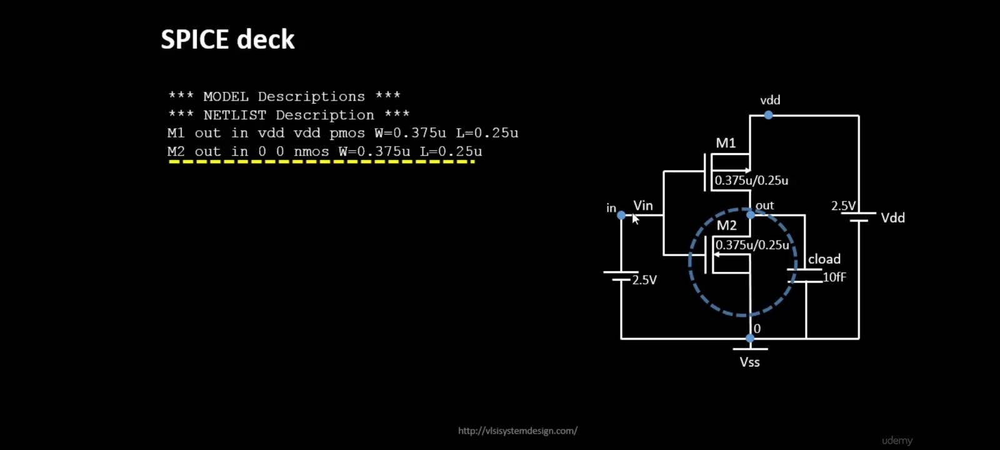

**Load Capacitance C_L**

This can be a simple MOSFET or another CMOS inverter or a logic gate

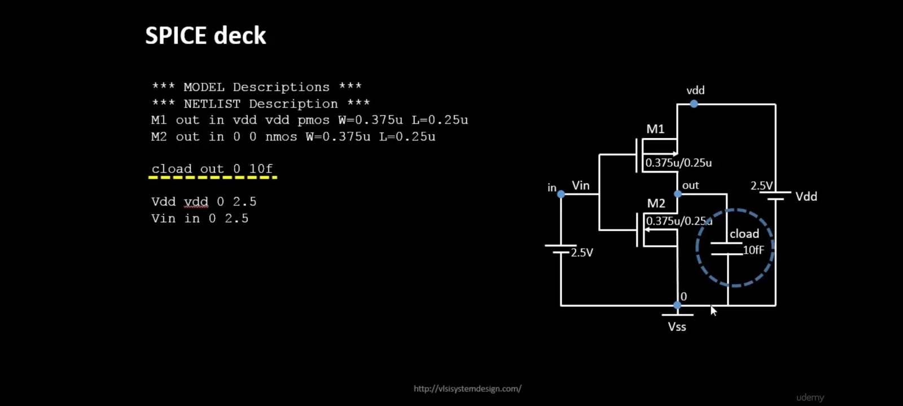

To find the VTC,we will only be sweeping the input voltage and measuring the output voltage.

* Sweep Vin from 0 → Vdd (2.5V) with step size 0.05.

**Model Files Library**

All the information about the technological parameteres is inside the model files library.

Now Let's do the SPICE simulations to get VTC
* For Wn/ln = Wp/Lp = 1.5

* For Wn/Ln=1.5, Wp/Lp=2.5 (PMOS width is 2.5 times more than NMOS)

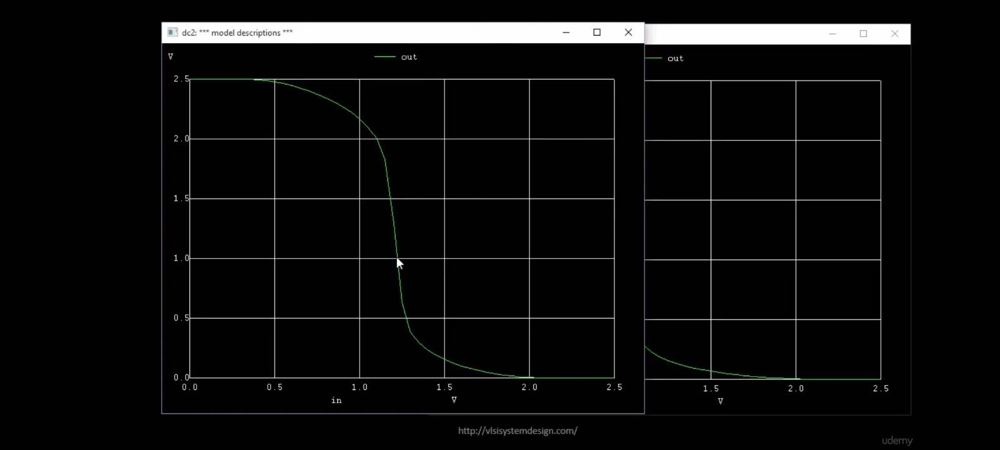

We observed that, when PMOS strength = NMOS Strength ,the previous graph has slightly shifted left side

* Increasing PMOS width:

 - Makes PMOS stronger
 - Output stays high longer

### L3 Labs Sky130 SPICE simulation for CMOS

Now Let us plot the VTC of CMOS Inverter

Let us go to the Day 3 file
.The W/L ratio of PMOS is 2.33 times greater than NMOS.
. Sweeping Vin from 0 to 1.8 with step size of 0.01V and plotting the Vout.

 Run the Simulation in oracle virtual box:
 
 

Switching Threyshold (Vm):  A point where Vin=Vout

Let us calculate the Switching Threshold. 

Note : To zoom in the curve; press righ mouse button + hold it.

We get,
* switching threshold (Vm) = 0.876V

**Transient analysis :** Transient analysis defines how input and output changes with respect to time.

Now let's go inside the Day 3 transient SPICE file.

Run the Simulation by **plot out vs time in**

We measure Delay at 50% of output curve (VDD) i.e 0.9V which is the switching voltage(Vm).

* **Rise Delay :** Rising part of waveform

**Rise delay = 2.484ns-2.149ns = 0.335ns**

* **Fall Delay :** Falling part of waveform

**Fall Delay = 4.335ns-4.052ns = 0.284ns**

  

